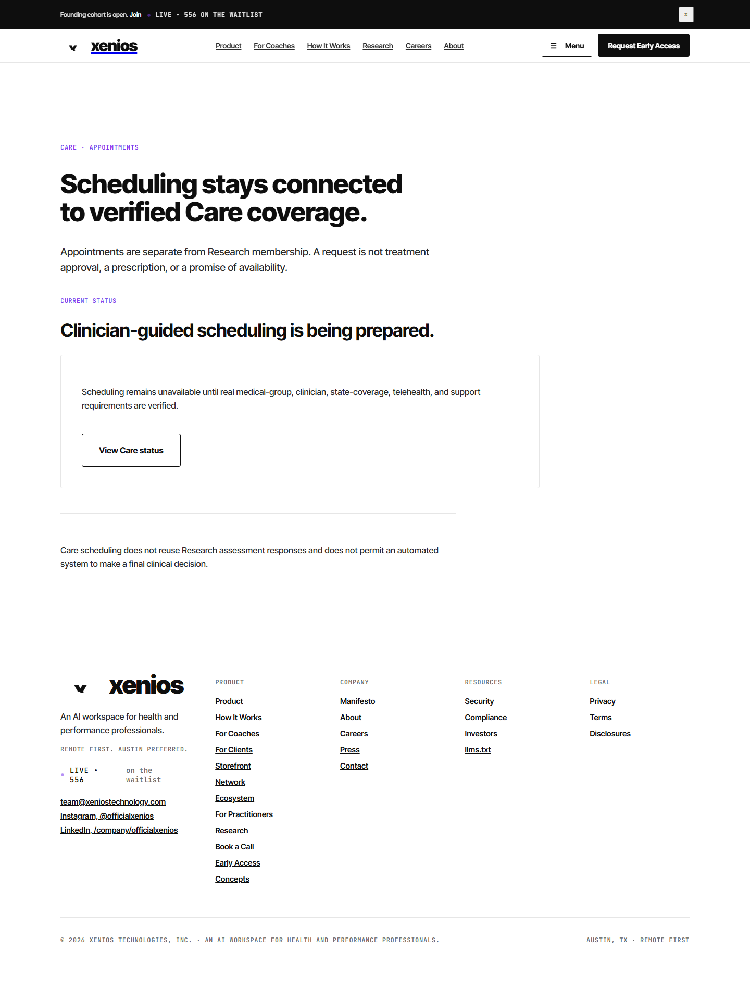
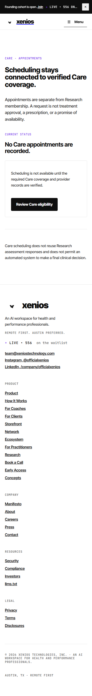
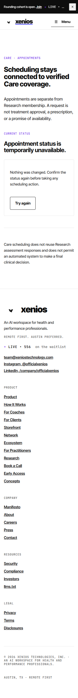
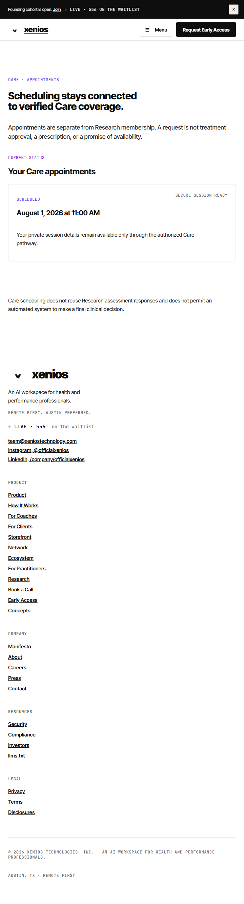

# Care PR 3 UI evidence

Captured: 2026-07-25

These images exercise the real `CareAppointmentsPage` component with
request-intercepted automated test responses. The scheduled record in the
populated image is a browser-only test fixture; it is not a database seed,
production record, clinician, provider, supported-state claim, or public
availability claim.

The temporary validation harness added only:

- the exact `/care/appointments` client route requested from Website 2; and
- the previously documented Website 2 narrow-mobile Navbar class correction.

Both shared-file changes were removed before the frozen branch was committed.
The committed PR remains free of direct edits to `client/src/App.tsx`,
`client/src/components/Navbar.tsx`, and `server/index.ts`.

## Desktop disabled state — 1440px

- Canonical Care capability response: `503 care_disabled`.
- No scheduling, clinician, state, provider, pharmacy, prescription, product,
  price, or treatment fact is displayed.
- Existing Xenios PageShell, typography, borders, buttons, spacing, and purple
  semantic accent are reused.

## Empty state — 375px

- API response contains no appointment records.
- The page provides one truthful next action and no invented availability.
- Document and Care-domain scroll widths equal client width: `375 / 375`.

## Error and retry state — 320px

- Dependency failure exposes stable user-safe copy and one Retry action.
- No adapter error text or provider details are rendered.
- Document and Care-domain scroll widths equal client width: `320 / 320`.

## Populated/reflow state — 720px

- Uses only an automated browser fixture to prove the final populated layout.
- No clinician name, license, pharmacy, treatment, price, product, or public
  availability is fabricated.
- The private provider-session reference is absent from the response and UI.
- Document and Care-domain scroll widths equal client width: `720 / 720`.
- This width is the 200%-zoom reflow equivalent for a 1440px viewport.

## Accessibility and behavior checks

- Semantic `main`, section heading, article, and aside structure.
- Explicit `aria-live="polite"` and `aria-busy` loading behavior.
- Keyboard-visible native button/link controls.
- Loading disables actions; errors preserve state and expose Retry.
- Status never relies on color alone.
- No Care-specific stylesheet, font, palette, gradient, shadow system, or
  duplicate header.

UI CONSISTENCY STATUS: MATCHES EXISTING XENIOS
