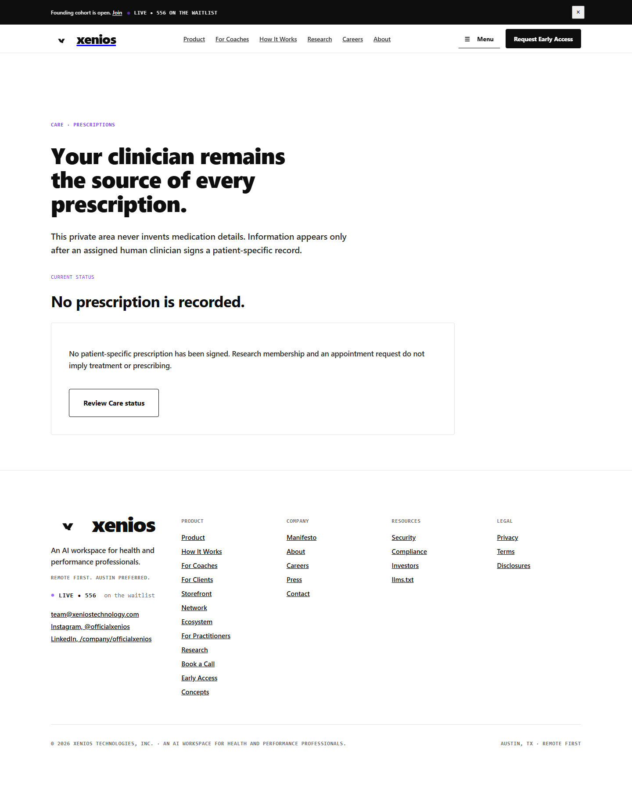
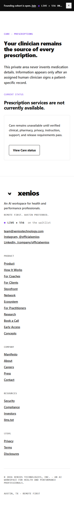
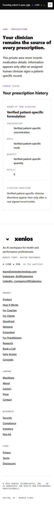
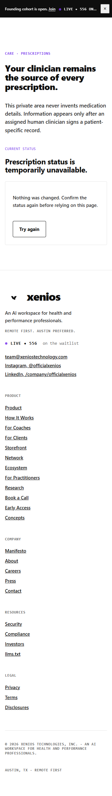

# Care PR 4 UI evidence

Captured from `CarePrescriptionsPage.tsx` through a local Vite harness on the
final PR4 source. Network responses were intercepted before persistence and
contained only clearly internal visual-evidence values. No database row,
external action, patient fact, pharmacy fact, medication, or production record
was created.

The mobile captures suppress the shared global header so this focused PR can
prove its owned Care module at 375px, 320px, and 200%-reflow-equivalent width
without altering Website 2-locked navigation. The isolated Care content
reported `scrollWidth === clientWidth` at 320px and at the reflow width.
Website 2 and Website 6 retain integrated shared-header verification.

## Desktop empty state — 1440px

## Disabled state — 375px

## Populated final layout — 320px

The values shown are explicit local visual-evidence strings, not a claim that a
real prescription exists. The production component renders this layout only
from an authorized patient-owned server response.

## Error/retry at 200%-reflow-equivalent width

## State and accessibility checks

- Loading state disables all clinical/pharmacy actions.
- Disabled state remains truthful and routes back to Care status.
- Authentication-required state exposes no private record.
- Empty state makes no treatment, prescription, or availability promise.
- Error state preserves the record and provides a labeled retry button.
- Populated values originate only from authorized patient-owned API records.
- Semantic headings, `aria-live`, `aria-busy`, labeled definition lists,
  visible text actions, and single-column mobile reflow are present.
- Routed Wouter + `PageShell` regression proves exactly one `<main>`, one
  `<h1>`, and the retained `#main-content` focus target on both PR4 routes
  across populated, empty, disabled, error, 320px, 375px, and reflow labels.
- Pharmacy clarification is a secondary action with a required private
  reference; the primary workflow action remains visually dominant.
- No independent Care branding, palette, gradient, duplicate header, new
  typography, or custom button system was introduced.

UI CONSISTENCY STATUS: MATCHES EXISTING XENIOS
