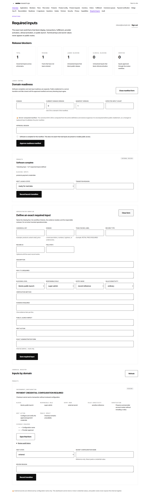
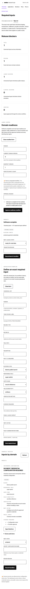
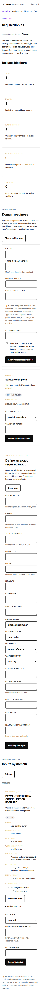

# Required-Input and Readiness UI Evidence

Candidate branch: `integration/required-input-readiness`

Date: 2026-07-25

The browser evidence used the real Vite client and the local-only fixture server
in `scripts/local-required-input-evidence-server.mjs`. The fixture provides a
non-production Supabase-auth response and one isolated required-input/readiness
response. It does not connect to production, create an account, provision a
role or namespace, seed a database, or perform an external action.

## Desktop — 1440px

- Existing `ResearchAdminShell`, typography, palette, borders, buttons, badges,
  metrics, and spacing are reused.
- Software completion and real-input readiness are visually distinct.
- The manifest form exposes no caller-supplied hash; it explains that the
  canonical SHA-256 is computed and revalidated by the server.
- The definition form exposes the explicit value-sensitivity classification.
- The exact missing fact occupies the final operational location.
- No credential value or public-facing technical detail is rendered.
- Document and viewport widths were both 1440 CSS pixels.

## Mobile — 375px

- Document and viewport widths were both 375 CSS pixels.
- The existing admin subnavigation remains a labeled controlled horizontal
  region; the document itself has no horizontal overflow.
- Metrics and forms become one column.

## Mobile — 320px

- Document and viewport widths were both 320 CSS pixels.
- No page-level horizontal overflow.
- Workflow buttons measured 52px high; the shared admin sign-out action was
  corrected to a 44px minimum target.
- Labels remain readable and the primary action remains distinct.

## State and accessibility evidence

- Component tests render both empty register/readiness states and a populated
  launch-blocking state.
- Loading, unavailable, denial, and retry behavior uses the existing
  `AdminBoundary`.
- Every form control has a programmatic label.
- External-secret entry is labeled `Secret configuration name` and explicitly
  says never to paste a credential value.
- The prior 720px CSS viewport reflow-equivalent check had no page overflow;
  the corrected 320px capture has 44–52px action targets.
- Browser console: zero warning/error entries.
- Native browser 200% zoom remains an explicit Website 6 integrated-candidate
  verification gate.

UI CONSISTENCY STATUS: MATCHES EXISTING XENIOS
