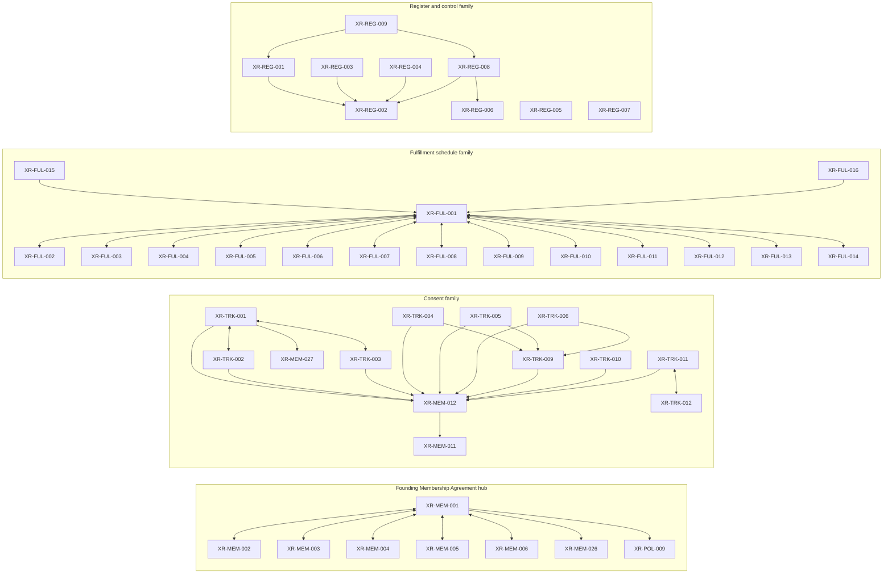

# Document Dependency Graph

```text
DRAFT — NOT LEGAL ADVICE
COUNSEL REVIEW REQUIRED
```

| Field | Value |
| --- | --- |
| Document key | XR-REG-003 |
| Title | Document Dependency Graph |
| Audience | internal |
| Required member state | n/a (internal) |
| Trigger | regenerated whenever register dependencies change |
| Route | internal |
| Version | 0.1.0-draft |
| Status | Draft |
| Counsel status | Not reviewed |
| Jurisdiction | United States, national scope; state-by-state review pending (see JURISDICTION_AND_APPLICABILITY_MATRIX) |
| Effective date | Not effective. Requires counsel approval and formal publication. |
| Retention | Permanent while the program operates; superseded versions archived per Document Control SOP (XR-REG-008) |
| Acceptance event | n/a (internal control document) |
| Withdrawal supported | No (internal control document) |
| Owner | Samuel Boadu, Founder |
| Dependencies | XR-REG-002 |
| Sources | See 00-register/SOURCE_REGISTRY.md |
| Review date | 2026-07-19 |

## 1. Purpose and method

This document is the visual and tabular map of how the 159 registered Xenios Research documents relate to one another. It is generated from the machine readable register (XR-REG-002, `document-register.json`). It has no independent authority: if this graph and the register disagree, the register wins, and this document must be regenerated.

Method:

- An edge A to B means document A lists document B in its `dependencies` array in the register.
- "Depended on by" (the reverse edge) is computed by inverting every `dependencies` entry in the register. No reverse edge is hand-authored.
- Many pairs reference each other (for example XR-MEM-001 and XR-MEM-002). Those appear as two directed edges, or as a double-headed arrow in the diagrams.
- Edge counts: 159 documents, every dependency key resolves to a registered document (no dangling references), 2 documents carry no edges in either direction (section 5).
- The diagrams in sections 2 and 3 are readable summaries and intentionally omit some edges. The table in section 4 is the complete edge list and is authoritative within this document.

A note on the two register-wide reference conventions: every document's metadata refers to the Jurisdiction and Applicability Matrix (XR-REG-005) in its jurisdiction row and to the Source Registry (XR-REG-007) in its sources row. Those references live in prose fields, not in the `dependencies` arrays, so they do not appear as edges here. See section 5.

## 2. Member journey: which documents gate each lifecycle step

The flowchart below follows one person from first visit through cancellation. Each stage box lists the documents that must be presented, accepted, or in force at that stage. Node labels are document keys only; titles are in the legend (section 4.1).

```mermaid
flowchart TD
    S1[Entrance] --> S2[Application] --> S3[Approval] --> S4[Identity and age verification] --> S5[Agreements] --> S6[Activation] --> S7[Assessment] --> S8[Tracker] --> S9[Commerce] --> S10[Cancellation]

    subgraph G1 [Entrance notices]
        PUB001[XR-PUB-001]
        PUB002[XR-PUB-002]
        PUB004[XR-PUB-004]
        PUB005[XR-PUB-005]
        PUB013[XR-PUB-013]
    end
    S1 --- G1

    subgraph G2 [Application gates]
        PUB003[XR-PUB-003]
        PUB008[XR-PUB-008]
        PUB009[XR-PUB-009]
        PUB010[XR-PUB-010]
        PUB011[XR-PUB-011]
        PUB012[XR-PUB-012]
    end
    S2 --- G2

    subgraph G4 [Verification gate]
        MEM011[XR-MEM-011]
        POL003[XR-POL-003]
    end
    S4 --- G4

    subgraph G5 [Agreements step, before payment]
        PUB007[XR-PUB-007]
        MEM001[XR-MEM-001]
        MEM002[XR-MEM-002]
        MEM004[XR-MEM-004]
        MEM005[XR-MEM-005]
        MEM006[XR-MEM-006]
        MEM007[XR-MEM-007]
        MEM008[XR-MEM-008]
        MEM009[XR-MEM-009]
        MEM013[XR-MEM-013]
        MEM017[XR-MEM-017]
        MEM018[XR-MEM-018]
        MEM021[XR-MEM-021]
        MEM022[XR-MEM-022]
    end
    S5 --- G5

    subgraph G6 [Activation: payment, recurring authorization, MFA]
        MEM003[XR-MEM-003]
        POL002[XR-POL-002]
    end
    S6 --- G6

    subgraph G7 [Assessment gates]
        MEM012[XR-MEM-012]
        MEM014[XR-MEM-014]
    end
    S7 --- G7

    subgraph G8 [Tracker unlock and per-feature consents]
        TRK001[XR-TRK-001]
        TRK013[XR-TRK-013]
        TRK002[XR-TRK-002]
        TRK003[XR-TRK-003]
        TRK004[XR-TRK-004]
        TRK005[XR-TRK-005]
        TRK006[XR-TRK-006]
        TRK007[XR-TRK-007]
        TRK009[XR-TRK-009]
        TRK010[XR-TRK-010]
        TRK011[XR-TRK-011]
    end
    S8 --- G8

    subgraph G9 [Commerce gates at checkout]
        COM001[XR-COM-001]
        COM018[XR-COM-018]
        COM015[XR-COM-015]
        COM016[XR-COM-016]
        COM002[XR-COM-002]
        COM011[XR-COM-011]
    end
    S9 --- G9

    subgraph G10 [Cancellation flow]
        MEM004b[XR-MEM-004]
        COM003[XR-COM-003]
        MEM027[XR-MEM-027]
        POL005[XR-POL-005]
    end
    S10 --- G10
```



Stage notes (what "gates" means at each step):

1. Entrance. XR-PUB-001 governs the shared-password entrance at /research; XR-PUB-002, XR-PUB-004, XR-PUB-005, and XR-PUB-013 are notices in force from the first visit. Nothing is accepted yet.
2. Application. Submission captures the Age 21+ Attestation (XR-PUB-008) and Application Accuracy Certification (XR-PUB-009); the Applicant Privacy Notice (XR-PUB-003) and Application Status Terms (XR-PUB-010) are presented with the form. XR-PUB-011 (marketing email) and XR-PUB-012 (SMS and Telegram) are optional, unchecked by default, and never gate progress.
3. Approval. An internal decision governed by the Application Status Terms (XR-PUB-010). No new member-facing document is accepted at this step.
4. Identity and age verification. XR-MEM-011 is the consent that gates hand-off to the verification provider; XR-POL-003 is the internal SOP that runs the step.
5. Agreements. All agreements are accepted before payment. XR-PUB-007 (Electronic Communications Consent) is accepted first, before any other agreement. The Founding Membership Agreement (XR-MEM-001) is the hub; the other listed documents are accepted or acknowledged in the same step.
6. Activation. The $50 activation payment is followed immediately by the $25 recurring authorization (XR-MEM-003), then password creation and mandatory MFA (member duties in XR-MEM-022, internal standard XR-POL-002).
7. Assessment. XR-MEM-012 (Sensitive Health Data Consent) gates the start of the mandatory assessment; XR-MEM-014 (Whole-Life Blueprint Terms) gates submission. Plan documents (XR-MEM-015 through XR-MEM-020) follow as plans are delivered and are not shown in the diagram.
8. Tracker. The tracker unlocks only after the assessment. XR-TRK-001 and XR-TRK-013 gate the unlock itself; the remaining tracker consents gate the first use of each feature (manual logging, sexual-wellness logging, photos, voice, video, face blur, media retention election, wearables, professional sharing). XR-TRK-008 (pose disclosure) and XR-TRK-012 (sharing revocation) accompany these and are listed in section 4.
9. Commerce. XR-COM-001 gates the first checkout, XR-COM-018 gates the first physical-product purchase, XR-COM-015 and instantiations of XR-COM-016 gate the first purchase of a supplement or research-product SKU, XR-COM-002 gates each product subscription, and XR-COM-011 gates any delayed-capture hold. The commerce notices (XR-COM-004 through XR-COM-009, XR-COM-012, XR-COM-013, XR-COM-017, XR-COM-019, XR-MEM-010) are linked at checkout but are notices, not acceptance gates.
10. Cancellation. Self-service. XR-MEM-004 is re-presented as the pre-confirmation disclosure (access ends immediately, remaining paid time is forfeited, subject to applicable law). XR-COM-003 governs the separate state of product subscriptions. XR-MEM-027 survives cancellation for privacy rights, and XR-POL-005 governs what is retained.

## 3. Densest dependency clusters

Four clusters carry most of the register's edge density. The universal hub is excluded from the diagrams to keep them readable: XR-POL-005 (Retention and Deletion Schedule) is a dependency of 134 of the 159 documents, because nearly every document states its retention rule by reference to it.

Inbound-edge counts for the top hubs (computed from the register):

| Hub | Title | Inbound edges |
| --- | --- | --- |
| XR-POL-005 | Retention and Deletion Schedule | 134 |
| XR-FUL-001 | Master Fulfillment Agreement | 16 |
| XR-FUL-004 | Quality Agreement | 14 |
| XR-MEM-012 | Sensitive Health Data Consent | 14 |
| XR-FUL-002 | Product Supply Schedule | 12 |
| XR-COM-019 | Product Concern and Adverse Event Instructions | 11 |
| XR-FUL-005 | Inventory and Lot Reporting Schedule | 11 |
| XR-MEM-027 | Privacy Rights Request Terms | 11 |
| XR-POL-009 | HIPAA and BAA Applicability Analysis | 11 |



Cluster notes:

- Founding Membership Agreement hub. XR-MEM-001 and the five activation documents (XR-MEM-002 through XR-MEM-006) are mutually dependent: the agreement incorporates them, and each of them is read under the agreement. XR-MEM-001 also depends on the referral terms (XR-MEM-026) and the HIPAA applicability analysis (XR-POL-009), plus XR-POL-005 (omitted from the diagram).
- Consent family. XR-MEM-012 (Sensitive Health Data Consent) is the root consent for everything the tracker touches: 14 documents depend on it, including every tracker consent. The media consents (XR-TRK-004, XR-TRK-005, XR-TRK-006) additionally depend on the retention election (XR-TRK-009), and professional sharing (XR-TRK-011) pairs with its revocation document (XR-TRK-012). The Tracker Privacy Notice (XR-TRK-001) is the family's presentation hub at tracker unlock.
- Fulfillment schedule family. XR-FUL-001 (Master Fulfillment Agreement) is a classic hub and spoke: schedules XR-FUL-002 through XR-FUL-014 are executed with it and are mutually dependent with it. The two questionnaires (XR-FUL-015, XR-FUL-016) depend on the family one way. This family also cross-links into commerce: XR-FUL-007 and XR-FUL-008 exchange edges with XR-COM-006, XR-COM-008, XR-COM-018, and XR-COM-019 (see section 4).
- Register and control family. XR-REG-002 (the machine readable register) is the root: the human readable register, this graph, the trigger matrix, and the Document Control SOP all depend on it, and nothing above it. XR-REG-005 and XR-REG-007 currently float free (section 5).

## 4. Complete dependency table

### 4.1 Key-to-title legend

| Key | Title |
| --- | --- |
| XR-AFF-001 | Member Referral Terms |
| XR-AFF-002 | Affiliate Program Agreement |
| XR-AFF-003 | Research Rep Agreement |
| XR-AFF-004 | Research Rep Code of Conduct |
| XR-AFF-005 | Organization Partner Agreement |
| XR-AFF-006 | Private Community Partner Agreement |
| XR-AFF-007 | Commission Schedule Templates |
| XR-AFF-008 | FTC Disclosure Policy |
| XR-AFF-009 | Claims and Content Policy |
| XR-AFF-010 | Social Media Policy |
| XR-AFF-011 | Lead Privacy and Security Addendum |
| XR-AFF-012 | Affiliate Data Processing Addendum |
| XR-AFF-013 | Event and Community Outreach Rules |
| XR-AFF-014 | Suspension and Termination Policy |
| XR-AFF-015 | Commission Dispute Policy |
| XR-AFF-016 | Tax and Payment Requirements |
| XR-AFF-017 | Wholesale and Sub-Distributor Placeholder |
| XR-AFF-018 | Professional and Institutional Account Placeholder |
| XR-COM-001 | Product Order Terms |
| XR-COM-002 | Product Subscription Authorization |
| XR-COM-003 | Subscription Pause, Skip, Reschedule, and Cancel Terms |
| XR-COM-004 | Shipping Policy |
| XR-COM-005 | Split Shipment Disclosure |
| XR-COM-006 | Expedited, Same-Day, and Temperature-Controlled Shipping Disclosure |
| XR-COM-007 | No Ordinary Returns Policy |
| XR-COM-008 | Damage, Loss, Incorrect Item, and Temperature Concern Policy |
| XR-COM-009 | Refund and Replacement Policy |
| XR-COM-010 | Large and Unusual Order Review Terms |
| XR-COM-011 | Payment Authorization and Delayed Capture Consent |
| XR-COM-012 | Waitlist Terms |
| XR-COM-013 | Inventory and Availability Disclaimer |
| XR-COM-014 | Product-Specific Acknowledgment Template |
| XR-COM-015 | Supplement Acknowledgment |
| XR-COM-016 | Research Material Acknowledgment Template |
| XR-COM-017 | Quality Document and COA Disclaimer |
| XR-COM-018 | Recall Notification Terms |
| XR-COM-019 | Product Concern and Adverse Event Instructions |
| XR-FUL-001 | Master Fulfillment Agreement |
| XR-FUL-002 | Product Supply Schedule |
| XR-FUL-003 | Service Level Schedule |
| XR-FUL-004 | Quality Agreement |
| XR-FUL-005 | Inventory and Lot Reporting Schedule |
| XR-FUL-006 | Storage and Shipping Schedule |
| XR-FUL-007 | Temperature-Control and Excursion Schedule |
| XR-FUL-008 | Recall and Product Concern Schedule |
| XR-FUL-009 | Data Protection and Security Addendum |
| XR-FUL-010 | Confidentiality and Restricted Data Addendum |
| XR-FUL-011 | Insurance and Indemnity Schedule |
| XR-FUL-012 | Pricing and Settlement Schedule |
| XR-FUL-013 | Chargeback, Refund, and Replacement Responsibility Matrix |
| XR-FUL-014 | Transition and Termination Assistance Schedule |
| XR-FUL-015 | Vendor Security Questionnaire |
| XR-FUL-016 | Supplier Qualification Questionnaire |
| XR-MEM-001 | Founding Membership Agreement |
| XR-MEM-002 | $50 Activation Terms |
| XR-MEM-003 | $25 Recurring Membership Authorization |
| XR-MEM-004 | Immediate Cancellation and Access-Termination Acknowledgment |
| XR-MEM-005 | Membership Covenant |
| XR-MEM-006 | Private Membership Confidentiality Covenant |
| XR-MEM-007 | No-Guarantee and Outcomes Acknowledgment |
| XR-MEM-008 | Assumption-of-Risk Acknowledgment |
| XR-MEM-009 | Research and Education Disclaimer |
| XR-MEM-010 | Product Access Policy |
| XR-MEM-011 | Identity and Age Verification Consent |
| XR-MEM-012 | Sensitive Health Data Consent |
| XR-MEM-013 | AI-Assisted Recommendation Disclosure |
| XR-MEM-014 | Whole-Life Blueprint Terms |
| XR-MEM-015 | Xenios 30 Terms |
| XR-MEM-016 | Xenios 90 Terms |
| XR-MEM-017 | Fitness Program Acknowledgment |
| XR-MEM-018 | Nutrition Program Acknowledgment |
| XR-MEM-019 | Monthly Check-In Terms |
| XR-MEM-020 | Early Plan-Change Terms |
| XR-MEM-021 | Secure Electronic Document Delivery Consent |
| XR-MEM-022 | Member Security and MFA Acknowledgment |
| XR-MEM-023 | Telegram Support Terms |
| XR-MEM-024 | Question and Answer Terms |
| XR-MEM-025 | Guide Library Terms |
| XR-MEM-026 | Member Referral and Store Credit Terms |
| XR-MEM-027 | Privacy Rights Request Terms |
| XR-POL-001 | Access Control Policy |
| XR-POL-002 | MFA and Passkey Policy |
| XR-POL-003 | Identity Verification Operations SOP |
| XR-POL-004 | Data Classification Policy |
| XR-POL-005 | Retention and Deletion Schedule |
| XR-POL-006 | Privacy Rights Request SOP |
| XR-POL-007 | Incident Response Plan |
| XR-POL-008 | FTC Health Breach Notification Analysis and SOP |
| XR-POL-009 | HIPAA and BAA Applicability Analysis |
| XR-POL-010 | Vendor Risk Management Policy |
| XR-POL-011 | Secure Development Policy |
| XR-POL-012 | Logging and Redaction Standard |
| XR-POL-013 | Backup and Disaster Recovery Plan |
| XR-POL-014 | Claims Approval SOP |
| XR-POL-015 | Guide Editorial Review SOP |
| XR-POL-016 | Product Publishing SOP |
| XR-POL-017 | Supplier Qualification SOP |
| XR-POL-018 | Receiving, Quarantine, and Release SOP |
| XR-POL-019 | FEFO and Expiry Management SOP |
| XR-POL-020 | Temperature Excursion SOP |
| XR-POL-021 | Complaint Handling SOP |
| XR-POL-022 | Adverse Event SOP |
| XR-POL-023 | Serious Adverse Event SOP |
| XR-POL-024 | Recall SOP |
| XR-POL-025 | Mock Recall SOP |
| XR-POL-026 | Refund and Replacement SOP |
| XR-POL-027 | Large Order Review SOP |
| XR-POL-028 | Fraud Prevention SOP |
| XR-POL-029 | Affiliate Compliance Monitoring SOP |
| XR-POL-030 | Research Rep Training and Certification SOP |
| XR-POL-031 | Telegram Operations SOP |
| XR-POL-032 | Infinity Operations SOP |
| XR-POL-033 | Media Handling SOP |
| XR-POL-034 | AI Governance Policy |
| XR-POL-035 | Accessibility Policy |
| XR-POL-036 | Legal Hold SOP |
| XR-PUB-001 | Private Entrance Terms |
| XR-PUB-002 | Website Terms of Use |
| XR-PUB-003 | Applicant Privacy Notice |
| XR-PUB-004 | General Privacy Notice |
| XR-PUB-005 | Cookie and Tracking Notice |
| XR-PUB-006 | Accessibility Statement |
| XR-PUB-007 | Electronic Communications Consent |
| XR-PUB-008 | Age 21+ Attestation |
| XR-PUB-009 | Application Accuracy Certification |
| XR-PUB-010 | Application Status Terms |
| XR-PUB-011 | Marketing Email Consent |
| XR-PUB-012 | Optional SMS and Telegram Consent |
| XR-PUB-013 | Support and Emergency Boundary Notice |
| XR-QTM-001 | Quantum Coming Soon Terms |
| XR-QTM-002 | Quantum Interest List Terms |
| XR-QTM-003 | Quantum Classification Questionnaire |
| XR-QTM-004 | Quantum Facility and Administration Matrix |
| XR-QTM-005 | Quantum Transaction Structure Memo |
| XR-QTM-006 | Quantum Consent Placeholder |
| XR-QTM-007 | Quantum Concern and Adverse Event Matrix |
| XR-QTM-008 | Quantum Commerce Activation Checklist |
| XR-REG-001 | Document Register (human readable) |
| XR-REG-002 | Document Register (machine readable) |
| XR-REG-003 | Document Dependency Graph |
| XR-REG-004 | Feature to Document Trigger Matrix |
| XR-REG-005 | Jurisdiction and Applicability Matrix |
| XR-REG-006 | Open Counsel Decisions |
| XR-REG-007 | Source Registry |
| XR-REG-008 | Document Control SOP |
| XR-REG-009 | Research Legal Library README |
| XR-TRK-001 | Tracker Privacy Notice |
| XR-TRK-002 | Manual Health Data Consent |
| XR-TRK-003 | Optional Sexual-Wellness Data Consent |
| XR-TRK-004 | Progress Photo Consent |
| XR-TRK-005 | Voice Recording and Transcription Consent |
| XR-TRK-006 | Exercise Video Consent |
| XR-TRK-007 | Face Blur and Image Processing Consent |
| XR-TRK-008 | Pose and Movement Analysis Disclosure |
| XR-TRK-009 | Raw Media Retention and Deletion Election |
| XR-TRK-010 | Wearable Connection Consent |
| XR-TRK-011 | Professional Sharing Authorization |
| XR-TRK-012 | Professional Sharing Revocation |
| XR-TRK-013 | Tracker Non-Diagnostic and Emergency Notice |

### 4.2 Dependencies and dependents (all 159 documents)

Reading the table: "Depends on" reproduces the document's `dependencies` array from the register, in register order. "Depended on by" lists every document whose `dependencies` array names this document, sorted by key. A dash means none.

| Key | Depends on | Depended on by |
| --- | --- | --- |
| XR-AFF-001 | XR-MEM-026, XR-AFF-002, XR-AFF-003, XR-POL-005 | XR-AFF-002, XR-AFF-007, XR-AFF-011, XR-AFF-016, XR-MEM-026, XR-POL-028 |
| XR-AFF-002 | XR-AFF-001, XR-AFF-003, XR-MEM-026, XR-POL-005 | XR-AFF-001, XR-AFF-003, XR-AFF-004, XR-AFF-005, XR-AFF-016, XR-AFF-017, XR-AFF-018, XR-POL-028, XR-POL-029 |
| XR-AFF-003 | XR-AFF-002, XR-AFF-004, XR-AFF-005, XR-POL-005 | XR-AFF-001, XR-AFF-002, XR-AFF-004, XR-AFF-005, XR-AFF-006, XR-AFF-016, XR-AFF-017, XR-AFF-018, XR-POL-028, XR-POL-029, XR-POL-030 |
| XR-AFF-004 | XR-AFF-003, XR-AFF-002, XR-POL-005 | XR-AFF-003, XR-AFF-005, XR-AFF-006, XR-POL-030 |
| XR-AFF-005 | XR-AFF-002, XR-AFF-003, XR-AFF-004, XR-AFF-006, XR-POL-005 | XR-AFF-003, XR-AFF-006 |
| XR-AFF-006 | XR-AFF-005, XR-AFF-003, XR-AFF-004, XR-POL-005 | XR-AFF-005 |
| XR-AFF-007 | XR-AFF-001, XR-MEM-026, XR-AFF-008, XR-AFF-009, XR-AFF-013, XR-AFF-014, XR-AFF-015, XR-POL-005 | XR-AFF-008, XR-AFF-009, XR-AFF-013, XR-AFF-014, XR-AFF-015, XR-AFF-016, XR-AFF-017 |
| XR-AFF-008 | XR-AFF-007, XR-AFF-009, XR-AFF-010, XR-AFF-013, XR-AFF-014 | XR-AFF-007, XR-AFF-009, XR-AFF-010, XR-AFF-013, XR-AFF-014, XR-POL-014, XR-POL-029, XR-POL-030 |
| XR-AFF-009 | XR-AFF-007, XR-AFF-008, XR-AFF-010, XR-AFF-013, XR-AFF-014 | XR-AFF-007, XR-AFF-008, XR-AFF-010, XR-AFF-013, XR-AFF-014, XR-AFF-017, XR-AFF-018, XR-POL-014, XR-POL-029, XR-POL-030 |
| XR-AFF-010 | XR-AFF-008, XR-AFF-009, XR-AFF-013, XR-AFF-014 | XR-AFF-008, XR-AFF-009, XR-AFF-013, XR-AFF-014, XR-POL-029 |
| XR-AFF-011 | XR-AFF-001, XR-AFF-012, XR-POL-005 | XR-AFF-012, XR-AFF-016 |
| XR-AFF-012 | XR-AFF-011, XR-POL-005 | XR-AFF-011, XR-AFF-016 |
| XR-AFF-013 | XR-AFF-007, XR-AFF-008, XR-AFF-009, XR-AFF-010, XR-AFF-014, XR-POL-005 | XR-AFF-007, XR-AFF-008, XR-AFF-009, XR-AFF-010, XR-AFF-014, XR-POL-029, XR-POL-030 |
| XR-AFF-014 | XR-AFF-007, XR-AFF-008, XR-AFF-009, XR-AFF-010, XR-AFF-013, XR-AFF-015, XR-POL-005 | XR-AFF-007, XR-AFF-008, XR-AFF-009, XR-AFF-010, XR-AFF-013, XR-AFF-015, XR-POL-028, XR-POL-029, XR-POL-030 |
| XR-AFF-015 | XR-AFF-007, XR-AFF-014, XR-POL-005 | XR-AFF-007, XR-AFF-014, XR-POL-028 |
| XR-AFF-016 | XR-AFF-001, XR-AFF-002, XR-AFF-003, XR-AFF-007, XR-AFF-011, XR-AFF-012, XR-POL-005 | XR-AFF-017 |
| XR-AFF-017 | XR-AFF-002, XR-AFF-003, XR-AFF-007, XR-AFF-009, XR-AFF-016 | XR-AFF-018 |
| XR-AFF-018 | XR-AFF-002, XR-AFF-003, XR-AFF-009, XR-AFF-017 | - |
| XR-COM-001 | XR-COM-002, XR-COM-003, XR-COM-010, XR-COM-011, XR-COM-012, XR-COM-013, XR-POL-005 | XR-COM-002, XR-COM-003, XR-COM-009, XR-COM-010, XR-COM-011, XR-COM-012, XR-COM-013, XR-POL-027 |
| XR-COM-002 | XR-COM-001, XR-COM-003, XR-COM-013, XR-POL-005 | XR-COM-001, XR-COM-003, XR-COM-011 |
| XR-COM-003 | XR-COM-001, XR-COM-002, XR-POL-005 | XR-COM-001, XR-COM-002 |
| XR-COM-004 | XR-COM-005, XR-COM-006, XR-COM-007, XR-COM-008, XR-COM-009, XR-POL-005 | XR-COM-005, XR-COM-006, XR-COM-008, XR-COM-009 |
| XR-COM-005 | XR-COM-004, XR-COM-006, XR-COM-008, XR-POL-005 | XR-COM-004, XR-COM-006, XR-COM-007, XR-COM-008 |
| XR-COM-006 | XR-COM-004, XR-COM-005, XR-COM-008, XR-POL-005 | XR-COM-004, XR-COM-005, XR-COM-008, XR-FUL-007, XR-POL-020 |
| XR-COM-007 | XR-COM-005, XR-COM-008, XR-COM-009, XR-POL-005 | XR-COM-004, XR-COM-008, XR-COM-009, XR-POL-026 |
| XR-COM-008 | XR-COM-004, XR-COM-005, XR-COM-006, XR-COM-007, XR-COM-009, XR-POL-005 | XR-COM-004, XR-COM-005, XR-COM-006, XR-COM-007, XR-COM-009, XR-FUL-007, XR-POL-020, XR-POL-021, XR-POL-026 |
| XR-COM-009 | XR-COM-001, XR-COM-004, XR-COM-007, XR-COM-008, XR-COM-010, XR-COM-011, XR-POL-005 | XR-COM-004, XR-COM-007, XR-COM-008, XR-POL-020, XR-POL-021, XR-POL-026 |
| XR-COM-010 | XR-COM-001, XR-COM-011, XR-POL-005 | XR-COM-001, XR-COM-009, XR-COM-011, XR-POL-027, XR-POL-032 |
| XR-COM-011 | XR-COM-001, XR-COM-002, XR-COM-010, XR-POL-005 | XR-COM-001, XR-COM-009, XR-COM-010, XR-POL-027 |
| XR-COM-012 | XR-COM-001, XR-COM-013, XR-POL-005 | XR-COM-001, XR-COM-013, XR-POL-016 |
| XR-COM-013 | XR-COM-001, XR-COM-012, XR-POL-005 | XR-COM-001, XR-COM-002, XR-COM-012, XR-POL-016, XR-POL-019 |
| XR-COM-014 | XR-COM-015, XR-COM-016, XR-COM-017, XR-COM-019, XR-POL-005 | XR-COM-015, XR-COM-016 |
| XR-COM-015 | XR-COM-014, XR-COM-017, XR-COM-019, XR-MEM-008, XR-POL-005 | XR-COM-014, XR-COM-017, XR-POL-023 |
| XR-COM-016 | XR-COM-014, XR-COM-017, XR-COM-019, XR-MEM-008, XR-POL-005 | XR-COM-014, XR-COM-017 |
| XR-COM-017 | XR-COM-015, XR-COM-016, XR-COM-018, XR-COM-019, XR-POL-005 | XR-COM-014, XR-COM-015, XR-COM-016, XR-COM-018, XR-COM-019, XR-POL-016 |
| XR-COM-018 | XR-COM-017, XR-COM-019, XR-POL-005 | XR-COM-017, XR-COM-019, XR-FUL-008, XR-POL-024, XR-POL-025 |
| XR-COM-019 | XR-COM-017, XR-COM-018, XR-POL-005 | XR-COM-014, XR-COM-015, XR-COM-016, XR-COM-017, XR-COM-018, XR-FUL-008, XR-POL-021, XR-POL-022, XR-POL-023, XR-POL-032, XR-POL-036 |
| XR-FUL-001 | XR-FUL-002, XR-FUL-003, XR-FUL-004, XR-FUL-005, XR-FUL-006, XR-FUL-007, XR-FUL-008, XR-FUL-009, XR-FUL-010, XR-FUL-011, XR-FUL-012, XR-FUL-013, XR-FUL-014, XR-POL-005 | XR-FUL-002, XR-FUL-003, XR-FUL-004, XR-FUL-005, XR-FUL-006, XR-FUL-007, XR-FUL-008, XR-FUL-009, XR-FUL-010, XR-FUL-011, XR-FUL-012, XR-FUL-013, XR-FUL-014, XR-FUL-015, XR-FUL-016, XR-POL-036 |
| XR-FUL-002 | XR-FUL-001, XR-FUL-004, XR-POL-005 | XR-FUL-001, XR-FUL-003, XR-FUL-004, XR-FUL-005, XR-FUL-007, XR-FUL-010, XR-FUL-012, XR-FUL-014, XR-FUL-016, XR-POL-016, XR-POL-017, XR-POL-018 |
| XR-FUL-003 | XR-FUL-001, XR-FUL-002, XR-FUL-004, XR-POL-005 | XR-FUL-001, XR-FUL-004 |
| XR-FUL-004 | XR-FUL-001, XR-FUL-002, XR-FUL-003, XR-POL-005 | XR-FUL-001, XR-FUL-002, XR-FUL-003, XR-FUL-013, XR-FUL-014, XR-FUL-016, XR-POL-017, XR-POL-018, XR-POL-019, XR-POL-020, XR-POL-021, XR-POL-022, XR-POL-023, XR-POL-025 |
| XR-FUL-005 | XR-FUL-001, XR-FUL-002, XR-FUL-006, XR-FUL-007, XR-FUL-008, XR-POL-005 | XR-FUL-001, XR-FUL-006, XR-FUL-007, XR-FUL-008, XR-FUL-009, XR-FUL-012, XR-FUL-014, XR-FUL-015, XR-POL-019, XR-POL-024, XR-POL-025 |
| XR-FUL-006 | XR-FUL-001, XR-FUL-005, XR-FUL-007, XR-FUL-008, XR-POL-005 | XR-FUL-001, XR-FUL-005, XR-FUL-007, XR-FUL-008, XR-FUL-011, XR-FUL-012, XR-FUL-013, XR-FUL-014, XR-FUL-016, XR-POL-019 |
| XR-FUL-007 | XR-FUL-001, XR-FUL-002, XR-FUL-005, XR-FUL-006, XR-FUL-008, XR-POL-005, XR-COM-006, XR-COM-008 | XR-FUL-001, XR-FUL-005, XR-FUL-006, XR-FUL-008, XR-FUL-016, XR-POL-020, XR-POL-026 |
| XR-FUL-008 | XR-FUL-001, XR-FUL-005, XR-FUL-006, XR-FUL-007, XR-POL-005, XR-COM-018, XR-COM-019 | XR-FUL-001, XR-FUL-005, XR-FUL-006, XR-FUL-007, XR-POL-022, XR-POL-023, XR-POL-024, XR-POL-025, XR-POL-026 |
| XR-FUL-009 | XR-FUL-001, XR-FUL-005, XR-FUL-010, XR-FUL-011, XR-FUL-014, XR-POL-005, XR-POL-009 | XR-FUL-001, XR-FUL-010, XR-FUL-013, XR-FUL-014, XR-FUL-015, XR-POL-010 |
| XR-FUL-010 | XR-FUL-001, XR-FUL-002, XR-FUL-009, XR-FUL-012, XR-FUL-014, XR-POL-005 | XR-FUL-001, XR-FUL-009, XR-FUL-014, XR-FUL-015 |
| XR-FUL-011 | XR-FUL-001, XR-FUL-006, XR-FUL-013, XR-FUL-014, XR-POL-005 | XR-FUL-001, XR-FUL-009, XR-FUL-013, XR-FUL-016 |
| XR-FUL-012 | XR-FUL-001, XR-FUL-002, XR-FUL-005, XR-FUL-006, XR-FUL-013, XR-FUL-014, XR-POL-005 | XR-FUL-001, XR-FUL-010, XR-FUL-013, XR-FUL-014 |
| XR-FUL-013 | XR-FUL-001, XR-FUL-004, XR-FUL-006, XR-FUL-009, XR-FUL-011, XR-FUL-012, XR-FUL-014, XR-POL-005 | XR-FUL-001, XR-FUL-011, XR-FUL-012, XR-FUL-014, XR-POL-026 |
| XR-FUL-014 | XR-FUL-001, XR-FUL-002, XR-FUL-004, XR-FUL-005, XR-FUL-006, XR-FUL-009, XR-FUL-010, XR-FUL-012, XR-FUL-013, XR-POL-005 | XR-FUL-001, XR-FUL-009, XR-FUL-010, XR-FUL-011, XR-FUL-012, XR-FUL-013 |
| XR-FUL-015 | XR-FUL-001, XR-FUL-005, XR-FUL-009, XR-FUL-010, XR-POL-005 | XR-POL-010 |
| XR-FUL-016 | XR-FUL-001, XR-FUL-002, XR-FUL-004, XR-FUL-006, XR-FUL-007, XR-FUL-011, XR-POL-005 | XR-POL-017 |
| XR-MEM-001 | XR-MEM-002, XR-MEM-003, XR-MEM-004, XR-MEM-005, XR-MEM-006, XR-MEM-026, XR-POL-005, XR-POL-009 | XR-MEM-002, XR-MEM-003, XR-MEM-004, XR-MEM-005, XR-MEM-006 |
| XR-MEM-002 | XR-MEM-001, XR-MEM-003, XR-MEM-004, XR-POL-005 | XR-MEM-001, XR-MEM-003 |
| XR-MEM-003 | XR-MEM-001, XR-MEM-002, XR-MEM-004, XR-POL-005 | XR-MEM-001, XR-MEM-002, XR-MEM-004 |
| XR-MEM-004 | XR-MEM-001, XR-MEM-003, XR-POL-005 | XR-MEM-001, XR-MEM-002, XR-MEM-003, XR-MEM-005, XR-MEM-006 |
| XR-MEM-005 | XR-MEM-001, XR-MEM-004, XR-MEM-006, XR-POL-005 | XR-MEM-001, XR-MEM-006 |
| XR-MEM-006 | XR-MEM-001, XR-MEM-004, XR-MEM-005, XR-POL-005 | XR-MEM-001, XR-MEM-005 |
| XR-MEM-007 | XR-MEM-008, XR-MEM-009, XR-MEM-013, XR-POL-005 | XR-MEM-008, XR-MEM-009, XR-MEM-013, XR-TRK-013 |
| XR-MEM-008 | XR-MEM-007, XR-MEM-009, XR-MEM-012, XR-POL-005 | XR-COM-015, XR-COM-016, XR-MEM-007, XR-MEM-009, XR-TRK-013 |
| XR-MEM-009 | XR-MEM-007, XR-MEM-008, XR-MEM-010, XR-MEM-013, XR-POL-005 | XR-MEM-007, XR-MEM-008, XR-MEM-010, XR-MEM-013, XR-POL-015, XR-TRK-008, XR-TRK-013 |
| XR-MEM-010 | XR-MEM-009, XR-MEM-011, XR-POL-005 | XR-MEM-009, XR-MEM-011, XR-POL-016 |
| XR-MEM-011 | XR-MEM-010, XR-MEM-012, XR-POL-005 | XR-MEM-010, XR-MEM-012 |
| XR-MEM-012 | XR-MEM-011, XR-MEM-013, XR-TRK-002, XR-TRK-003, XR-TRK-009, XR-POL-005, XR-POL-009 | XR-MEM-008, XR-MEM-011, XR-MEM-013, XR-POL-009, XR-TRK-001, XR-TRK-002, XR-TRK-003, XR-TRK-004, XR-TRK-005, XR-TRK-006, XR-TRK-008, XR-TRK-009, XR-TRK-010, XR-TRK-011 |
| XR-MEM-013 | XR-MEM-007, XR-MEM-009, XR-MEM-012, XR-POL-005 | XR-MEM-007, XR-MEM-009, XR-MEM-012, XR-POL-034 |
| XR-MEM-014 | XR-MEM-015, XR-MEM-016, XR-MEM-017, XR-MEM-018, XR-MEM-019, XR-MEM-020, XR-POL-005 | XR-MEM-015, XR-MEM-016, XR-MEM-017, XR-MEM-018, XR-MEM-019, XR-MEM-020, XR-POL-034 |
| XR-MEM-015 | XR-MEM-014, XR-MEM-016, XR-MEM-017, XR-MEM-018, XR-MEM-019, XR-MEM-020, XR-POL-005 | XR-MEM-014, XR-MEM-016, XR-MEM-017, XR-MEM-018, XR-MEM-019, XR-MEM-020, XR-POL-034 |
| XR-MEM-016 | XR-MEM-014, XR-MEM-015, XR-MEM-017, XR-MEM-018, XR-MEM-019, XR-POL-005 | XR-MEM-014, XR-MEM-015, XR-MEM-017, XR-MEM-018, XR-MEM-019, XR-MEM-020, XR-POL-034 |
| XR-MEM-017 | XR-MEM-014, XR-MEM-015, XR-MEM-016, XR-POL-005 | XR-MEM-014, XR-MEM-015, XR-MEM-016 |
| XR-MEM-018 | XR-MEM-014, XR-MEM-015, XR-MEM-016, XR-POL-005 | XR-MEM-014, XR-MEM-015, XR-MEM-016 |
| XR-MEM-019 | XR-MEM-014, XR-MEM-015, XR-MEM-016, XR-MEM-020, XR-POL-005 | XR-MEM-014, XR-MEM-015, XR-MEM-016, XR-MEM-020 |
| XR-MEM-020 | XR-MEM-014, XR-MEM-015, XR-MEM-016, XR-MEM-019, XR-POL-005 | XR-MEM-014, XR-MEM-015, XR-MEM-019 |
| XR-MEM-021 | XR-MEM-022, XR-MEM-023, XR-MEM-027, XR-POL-005 | XR-MEM-022, XR-MEM-023, XR-MEM-025, XR-MEM-027 |
| XR-MEM-022 | XR-MEM-021, XR-MEM-023, XR-MEM-027, XR-POL-005 | XR-MEM-021, XR-MEM-023 |
| XR-MEM-023 | XR-MEM-021, XR-MEM-022, XR-MEM-024, XR-MEM-027, XR-POL-005 | XR-MEM-021, XR-MEM-022, XR-MEM-024, XR-MEM-027, XR-POL-012, XR-POL-021, XR-POL-022, XR-POL-031 |
| XR-MEM-024 | XR-MEM-023, XR-MEM-025, XR-MEM-027, XR-POL-005 | XR-MEM-023, XR-MEM-025, XR-POL-031, XR-POL-034 |
| XR-MEM-025 | XR-MEM-021, XR-MEM-024, XR-MEM-027, XR-POL-005 | XR-MEM-024, XR-POL-015, XR-POL-034 |
| XR-MEM-026 | XR-AFF-001, XR-MEM-027, XR-POL-005 | XR-AFF-001, XR-AFF-002, XR-AFF-007, XR-MEM-001, XR-POL-028 |
| XR-MEM-027 | XR-MEM-021, XR-MEM-023, XR-POL-005, XR-POL-009 | XR-MEM-021, XR-MEM-022, XR-MEM-023, XR-MEM-024, XR-MEM-025, XR-MEM-026, XR-POL-036, XR-TRK-001, XR-TRK-002, XR-TRK-003, XR-TRK-012 |
| XR-POL-001 | XR-POL-002, XR-POL-003, XR-POL-004, XR-POL-005 | XR-POL-002, XR-POL-003, XR-POL-004, XR-POL-032 |
| XR-POL-002 | XR-POL-001, XR-POL-005 | XR-POL-001, XR-POL-003, XR-POL-006 |
| XR-POL-003 | XR-POL-001, XR-POL-002, XR-POL-004, XR-POL-005 | XR-POL-001, XR-POL-005, XR-POL-006 |
| XR-POL-004 | XR-POL-001, XR-POL-005, XR-POL-006, XR-POL-009 | XR-POL-001, XR-POL-003, XR-POL-005, XR-POL-006, XR-POL-013, XR-POL-031, XR-POL-032, XR-POL-033, XR-POL-034 |
| XR-POL-005 | XR-POL-003, XR-POL-004, XR-POL-006 | XR-AFF-001, XR-AFF-002, XR-AFF-003, XR-AFF-004, XR-AFF-005, XR-AFF-006, XR-AFF-007, XR-AFF-011, XR-AFF-012, XR-AFF-013, XR-AFF-014, XR-AFF-015, XR-AFF-016, XR-COM-001, XR-COM-002, XR-COM-003, XR-COM-004, XR-COM-005, XR-COM-006, XR-COM-007, XR-COM-008, XR-COM-009, XR-COM-010, XR-COM-011, XR-COM-012, XR-COM-013, XR-COM-014, XR-COM-015, XR-COM-016, XR-COM-017, XR-COM-018, XR-COM-019, XR-FUL-001, XR-FUL-002, XR-FUL-003, XR-FUL-004, XR-FUL-005, XR-FUL-006, XR-FUL-007, XR-FUL-008, XR-FUL-009, XR-FUL-010, XR-FUL-011, XR-FUL-012, XR-FUL-013, XR-FUL-014, XR-FUL-015, XR-FUL-016, XR-MEM-001, XR-MEM-002, XR-MEM-003, XR-MEM-004, XR-MEM-005, XR-MEM-006, XR-MEM-007, XR-MEM-008, XR-MEM-009, XR-MEM-010, XR-MEM-011, XR-MEM-012, XR-MEM-013, XR-MEM-014, XR-MEM-015, XR-MEM-016, XR-MEM-017, XR-MEM-018, XR-MEM-019, XR-MEM-020, XR-MEM-021, XR-MEM-022, XR-MEM-023, XR-MEM-024, XR-MEM-025, XR-MEM-026, XR-MEM-027, XR-POL-001, XR-POL-002, XR-POL-003, XR-POL-004, XR-POL-006, XR-POL-007, XR-POL-008, XR-POL-009, XR-POL-010, XR-POL-011, XR-POL-012, XR-POL-013, XR-POL-014, XR-POL-015, XR-POL-016, XR-POL-017, XR-POL-018, XR-POL-019, XR-POL-020, XR-POL-021, XR-POL-022, XR-POL-023, XR-POL-024, XR-POL-025, XR-POL-026, XR-POL-027, XR-POL-028, XR-POL-029, XR-POL-030, XR-POL-031, XR-POL-032, XR-POL-033, XR-POL-034, XR-POL-035, XR-POL-036, XR-PUB-001, XR-PUB-002, XR-PUB-003, XR-PUB-004, XR-PUB-005, XR-PUB-006, XR-PUB-007, XR-PUB-008, XR-PUB-009, XR-PUB-010, XR-PUB-011, XR-PUB-012, XR-PUB-013, XR-TRK-001, XR-TRK-002, XR-TRK-003, XR-TRK-004, XR-TRK-005, XR-TRK-006, XR-TRK-007, XR-TRK-009, XR-TRK-010, XR-TRK-011, XR-TRK-012 |
| XR-POL-006 | XR-POL-002, XR-POL-003, XR-POL-004, XR-POL-005 | XR-POL-004, XR-POL-005 |
| XR-POL-007 | XR-POL-005, XR-POL-008, XR-POL-009, XR-POL-010, XR-POL-012 | XR-POL-008, XR-POL-010, XR-POL-011, XR-POL-012, XR-POL-013, XR-POL-031, XR-POL-032, XR-POL-033, XR-POL-036 |
| XR-POL-008 | XR-POL-005, XR-POL-007, XR-POL-009, XR-POL-010, XR-POL-012, XR-TRK-001, XR-TRK-002, XR-TRK-010 | XR-POL-007, XR-POL-009, XR-POL-010, XR-POL-013, XR-TRK-001, XR-TRK-010 |
| XR-POL-009 | XR-POL-005, XR-POL-008, XR-POL-010, XR-TRK-011, XR-MEM-012 | XR-FUL-009, XR-MEM-001, XR-MEM-012, XR-MEM-027, XR-POL-004, XR-POL-007, XR-POL-008, XR-POL-010, XR-PUB-004, XR-TRK-001, XR-TRK-011 |
| XR-POL-010 | XR-POL-005, XR-POL-007, XR-POL-008, XR-POL-009, XR-POL-011, XR-POL-012, XR-FUL-009, XR-FUL-015 | XR-POL-007, XR-POL-008, XR-POL-009, XR-POL-011, XR-POL-034 |
| XR-POL-011 | XR-POL-005, XR-POL-007, XR-POL-010, XR-POL-012 | XR-POL-010, XR-POL-012 |
| XR-POL-012 | XR-POL-005, XR-POL-007, XR-POL-011, XR-MEM-023 | XR-POL-007, XR-POL-008, XR-POL-010, XR-POL-011, XR-POL-031, XR-POL-032, XR-POL-033, XR-POL-034, XR-POL-035, XR-POL-036 |
| XR-POL-013 | XR-POL-004, XR-POL-005, XR-POL-007, XR-POL-008 | - |
| XR-POL-014 | XR-POL-005, XR-POL-015, XR-POL-016, XR-AFF-008, XR-AFF-009 | XR-POL-015, XR-POL-016 |
| XR-POL-015 | XR-POL-005, XR-POL-014, XR-MEM-009, XR-MEM-025 | XR-POL-014 |
| XR-POL-016 | XR-POL-005, XR-POL-014, XR-POL-017, XR-MEM-010, XR-COM-012, XR-COM-013, XR-COM-017, XR-FUL-002 | XR-POL-014, XR-POL-017 |
| XR-POL-017 | XR-POL-005, XR-POL-016, XR-POL-018, XR-FUL-002, XR-FUL-004, XR-FUL-016 | XR-POL-016, XR-POL-018 |
| XR-POL-018 | XR-POL-005, XR-POL-017, XR-FUL-002, XR-FUL-004 | XR-POL-017 |
| XR-POL-019 | XR-POL-005, XR-POL-020, XR-POL-024, XR-COM-013, XR-FUL-004, XR-FUL-005, XR-FUL-006 | XR-POL-020, XR-POL-021, XR-POL-024, XR-POL-025, XR-POL-026 |
| XR-POL-020 | XR-POL-005, XR-POL-019, XR-POL-021, XR-COM-006, XR-COM-008, XR-COM-009, XR-FUL-004, XR-FUL-007 | XR-POL-019, XR-POL-021, XR-POL-024 |
| XR-POL-021 | XR-POL-005, XR-POL-019, XR-POL-020, XR-POL-022, XR-POL-024, XR-COM-008, XR-COM-009, XR-COM-019, XR-MEM-023, XR-FUL-004 | XR-POL-020, XR-POL-022, XR-POL-024 |
| XR-POL-022 | XR-POL-005, XR-POL-021, XR-POL-023, XR-POL-024, XR-COM-019, XR-MEM-023, XR-FUL-004, XR-FUL-008 | XR-POL-021, XR-POL-023, XR-POL-024 |
| XR-POL-023 | XR-POL-005, XR-POL-022, XR-POL-024, XR-COM-015, XR-COM-019, XR-FUL-004, XR-FUL-008 | XR-POL-022, XR-POL-024 |
| XR-POL-024 | XR-POL-005, XR-POL-019, XR-POL-020, XR-POL-021, XR-POL-022, XR-POL-023, XR-COM-018, XR-FUL-005, XR-FUL-008 | XR-POL-019, XR-POL-021, XR-POL-022, XR-POL-023 |
| XR-POL-025 | XR-POL-005, XR-POL-019, XR-POL-026, XR-COM-018, XR-FUL-004, XR-FUL-005, XR-FUL-008 | XR-POL-026 |
| XR-POL-026 | XR-POL-005, XR-POL-019, XR-POL-025, XR-POL-027, XR-POL-028, XR-COM-007, XR-COM-008, XR-COM-009, XR-FUL-007, XR-FUL-008, XR-FUL-013 | XR-POL-025, XR-POL-027, XR-POL-028 |
| XR-POL-027 | XR-POL-005, XR-POL-026, XR-POL-028, XR-COM-010, XR-COM-011, XR-COM-001 | XR-POL-026, XR-POL-028 |
| XR-POL-028 | XR-POL-005, XR-POL-026, XR-POL-027, XR-POL-029, XR-AFF-001, XR-AFF-002, XR-AFF-003, XR-AFF-014, XR-AFF-015, XR-MEM-026 | XR-POL-026, XR-POL-027, XR-POL-029, XR-POL-030 |
| XR-POL-029 | XR-POL-005, XR-POL-028, XR-POL-030, XR-AFF-002, XR-AFF-003, XR-AFF-008, XR-AFF-009, XR-AFF-010, XR-AFF-013, XR-AFF-014 | XR-POL-028, XR-POL-030 |
| XR-POL-030 | XR-POL-005, XR-POL-028, XR-POL-029, XR-AFF-003, XR-AFF-004, XR-AFF-008, XR-AFF-009, XR-AFF-013, XR-AFF-014 | XR-POL-029 |
| XR-POL-031 | XR-MEM-023, XR-MEM-024, XR-PUB-012, XR-PUB-013, XR-POL-004, XR-POL-005, XR-POL-007, XR-POL-012, XR-POL-032 | XR-POL-032 |
| XR-POL-032 | XR-POL-001, XR-POL-004, XR-POL-005, XR-POL-007, XR-POL-012, XR-POL-031, XR-POL-034, XR-COM-010, XR-COM-019 | XR-POL-031, XR-POL-034 |
| XR-POL-033 | XR-TRK-004, XR-TRK-005, XR-TRK-006, XR-TRK-007, XR-TRK-008, XR-TRK-009, XR-POL-004, XR-POL-005, XR-POL-007, XR-POL-012, XR-POL-036 | XR-POL-036 |
| XR-POL-034 | XR-MEM-013, XR-MEM-014, XR-MEM-015, XR-MEM-016, XR-MEM-024, XR-MEM-025, XR-POL-004, XR-POL-005, XR-POL-010, XR-POL-012, XR-POL-032 | XR-POL-032 |
| XR-POL-035 | XR-PUB-006, XR-POL-005, XR-POL-012 | - |
| XR-POL-036 | XR-POL-005, XR-POL-007, XR-POL-012, XR-POL-033, XR-MEM-027, XR-TRK-009, XR-COM-019, XR-FUL-001 | XR-POL-033 |
| XR-PUB-001 | XR-PUB-002, XR-PUB-008, XR-PUB-009, XR-PUB-010, XR-PUB-013, XR-POL-005 | XR-PUB-002 |
| XR-PUB-002 | XR-PUB-001, XR-PUB-008, XR-PUB-009, XR-PUB-010, XR-PUB-013, XR-POL-005 | XR-PUB-001, XR-PUB-010, XR-PUB-013 |
| XR-PUB-003 | XR-PUB-004, XR-PUB-011, XR-PUB-012, XR-POL-005 | XR-PUB-004, XR-PUB-011 |
| XR-PUB-004 | XR-PUB-003, XR-PUB-005, XR-PUB-007, XR-PUB-011, XR-PUB-012, XR-POL-005, XR-POL-009 | XR-PUB-003, XR-PUB-005, XR-PUB-006, XR-PUB-007, XR-PUB-011, XR-PUB-012, XR-TRK-001 |
| XR-PUB-005 | XR-PUB-004, XR-POL-005 | XR-PUB-004 |
| XR-PUB-006 | XR-PUB-004, XR-POL-005 | XR-POL-035 |
| XR-PUB-007 | XR-PUB-004, XR-POL-005 | XR-PUB-004 |
| XR-PUB-008 | XR-PUB-009, XR-PUB-010, XR-POL-005 | XR-PUB-001, XR-PUB-002, XR-PUB-009, XR-PUB-010 |
| XR-PUB-009 | XR-PUB-008, XR-PUB-010, XR-POL-005 | XR-PUB-001, XR-PUB-002, XR-PUB-008, XR-PUB-010 |
| XR-PUB-010 | XR-PUB-002, XR-PUB-008, XR-PUB-009, XR-POL-005 | XR-PUB-001, XR-PUB-002, XR-PUB-008, XR-PUB-009 |
| XR-PUB-011 | XR-PUB-003, XR-PUB-004, XR-POL-005 | XR-PUB-003, XR-PUB-004, XR-PUB-012 |
| XR-PUB-012 | XR-PUB-004, XR-PUB-011, XR-POL-005 | XR-POL-031, XR-PUB-003, XR-PUB-004 |
| XR-PUB-013 | XR-PUB-002, XR-POL-005 | XR-POL-031, XR-PUB-001, XR-PUB-002, XR-TRK-013 |
| XR-QTM-001 | XR-QTM-002, XR-QTM-008 | XR-QTM-002, XR-QTM-008 |
| XR-QTM-002 | XR-QTM-001, XR-QTM-008 | XR-QTM-001, XR-QTM-008 |
| XR-QTM-003 | XR-QTM-004, XR-QTM-005, XR-QTM-008 | XR-QTM-004, XR-QTM-005, XR-QTM-006, XR-QTM-007, XR-QTM-008 |
| XR-QTM-004 | XR-QTM-003, XR-QTM-005, XR-QTM-008 | XR-QTM-003, XR-QTM-005, XR-QTM-006, XR-QTM-007, XR-QTM-008 |
| XR-QTM-005 | XR-QTM-003, XR-QTM-004, XR-QTM-008 | XR-QTM-003, XR-QTM-004, XR-QTM-006, XR-QTM-007, XR-QTM-008 |
| XR-QTM-006 | XR-QTM-003, XR-QTM-004, XR-QTM-005, XR-QTM-008 | XR-QTM-008 |
| XR-QTM-007 | XR-QTM-003, XR-QTM-004, XR-QTM-005, XR-QTM-008 | XR-QTM-008 |
| XR-QTM-008 | XR-QTM-001, XR-QTM-002, XR-QTM-003, XR-QTM-004, XR-QTM-005, XR-QTM-006, XR-QTM-007 | XR-QTM-001, XR-QTM-002, XR-QTM-003, XR-QTM-004, XR-QTM-005, XR-QTM-006, XR-QTM-007 |
| XR-REG-001 | XR-REG-002 | XR-REG-009 |
| XR-REG-002 | - | XR-REG-001, XR-REG-003, XR-REG-004, XR-REG-008 |
| XR-REG-003 | XR-REG-002 | - |
| XR-REG-004 | XR-REG-002 | - |
| XR-REG-005 | - | - |
| XR-REG-006 | - | XR-REG-008 |
| XR-REG-007 | - | - |
| XR-REG-008 | XR-REG-002, XR-REG-006 | XR-REG-009 |
| XR-REG-009 | XR-REG-001, XR-REG-008 | - |
| XR-TRK-001 | XR-TRK-002, XR-TRK-003, XR-TRK-010, XR-TRK-011, XR-TRK-012, XR-TRK-013, XR-MEM-012, XR-MEM-027, XR-PUB-004, XR-POL-005, XR-POL-008, XR-POL-009 | XR-POL-008, XR-TRK-002, XR-TRK-003, XR-TRK-010, XR-TRK-011, XR-TRK-013 |
| XR-TRK-002 | XR-TRK-001, XR-TRK-003, XR-TRK-013, XR-MEM-012, XR-MEM-027, XR-POL-005 | XR-MEM-012, XR-POL-008, XR-TRK-001, XR-TRK-003, XR-TRK-010 |
| XR-TRK-003 | XR-TRK-001, XR-TRK-002, XR-MEM-012, XR-MEM-027, XR-POL-005 | XR-MEM-012, XR-TRK-001, XR-TRK-002, XR-TRK-011 |
| XR-TRK-004 | XR-MEM-012, XR-TRK-007, XR-TRK-009, XR-POL-005 | XR-POL-033, XR-TRK-007, XR-TRK-009 |
| XR-TRK-005 | XR-MEM-012, XR-TRK-009, XR-POL-005 | XR-POL-033, XR-TRK-009 |
| XR-TRK-006 | XR-MEM-012, XR-TRK-008, XR-TRK-009, XR-POL-005 | XR-POL-033, XR-TRK-007, XR-TRK-008, XR-TRK-009 |
| XR-TRK-007 | XR-TRK-004, XR-TRK-006, XR-TRK-009, XR-POL-005 | XR-POL-033, XR-TRK-004 |
| XR-TRK-008 | XR-TRK-006, XR-TRK-009, XR-MEM-009, XR-MEM-012 | XR-POL-033, XR-TRK-006 |
| XR-TRK-009 | XR-TRK-004, XR-TRK-005, XR-TRK-006, XR-MEM-012, XR-POL-005 | XR-MEM-012, XR-POL-033, XR-POL-036, XR-TRK-004, XR-TRK-005, XR-TRK-006, XR-TRK-007, XR-TRK-008 |
| XR-TRK-010 | XR-TRK-001, XR-TRK-002, XR-MEM-012, XR-POL-005, XR-POL-008 | XR-POL-008, XR-TRK-001 |
| XR-TRK-011 | XR-TRK-001, XR-TRK-003, XR-TRK-012, XR-MEM-012, XR-POL-005, XR-POL-009 | XR-POL-009, XR-TRK-001, XR-TRK-012 |
| XR-TRK-012 | XR-TRK-011, XR-MEM-027, XR-POL-005 | XR-TRK-001, XR-TRK-011 |
| XR-TRK-013 | XR-TRK-001, XR-MEM-007, XR-MEM-008, XR-MEM-009, XR-PUB-013 | XR-TRK-001, XR-TRK-002 |

## 5. Orphan documents

Two registered documents have no inbound and no outbound edges in the register's `dependencies` arrays:

- XR-REG-005 (Jurisdiction and Applicability Matrix)
- XR-REG-007 (Source Registry)

Neither is actually unused. Every registered document points to XR-REG-005 in its jurisdiction metadata row and to XR-REG-007 in its sources metadata row. Those references live in prose metadata fields rather than in the `dependencies` arrays, so they carry no edges here. This is a register-convention question, not a drafting defect; it is flagged for a decision in section 6.

No other document is isolated: the remaining 157 documents each have at least one edge, and every dependency key in the register resolves to a registered document.

## Open items for counsel

- Confirm whether the metadata-level references that every document makes to XR-REG-005 (jurisdiction row) and XR-REG-007 (sources row) should be promoted to formal `dependencies` edges in XR-REG-002, which would remove the two orphans reported in section 5, or whether register-family control documents should stay out of the dependency arrays by convention.
- The register records many mutual (two-way) dependencies, for example XR-MEM-001 with each activation document and XR-FUL-001 with each schedule. Confirm whether counsel wants edge types distinguished in a future register version (for example "incorporates", "gates", "references") so that incorporation-by-reference chains can be read directly from the data.
- XR-POL-005 is a dependency of 134 documents solely because retention is stated by reference. Confirm that a future change to the Retention and Deletion Schedule triggers review of dependents through the Document Control SOP (XR-REG-008) rather than a re-acceptance event for members.
- This graph is generated from XR-REG-002 and must be regenerated whenever register dependencies change. Confirm the regeneration duty and its owner are recorded in the Document Control SOP (XR-REG-008).
- The XR-MEM-026 and XR-AFF-001 pair intentionally coexists (member-facing terms versus program-level terms) and appears in this graph as a two-way edge; consolidation is already flagged in those documents and remains open.

## Version history

| Version | Date | Notes |
| --- | --- | --- |
| 0.1.0-draft | 2026-07-19 | Initial draft for counsel review. |
