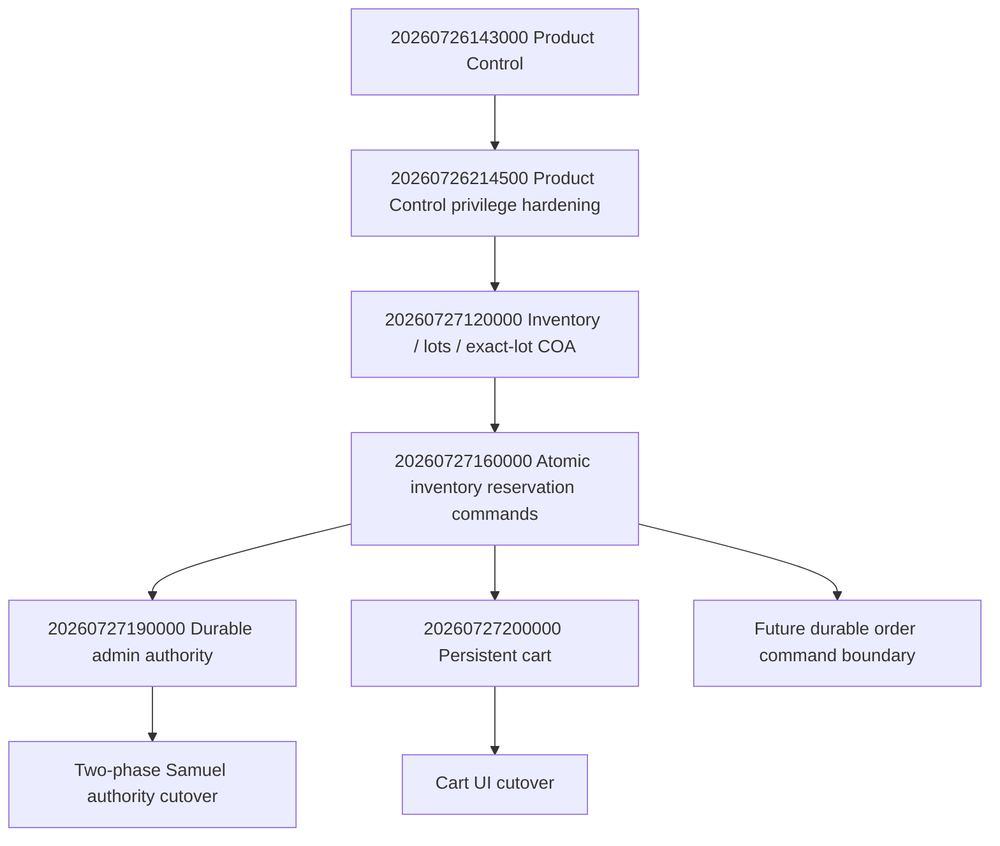

# Migration DAG and Exact Application Order

## Immutable baseline

- Frozen source base: `64cceb82f72170004525d5c78dc49ea7b77fdf6b`
- PR #103 source: `97ee1895763ea9c243de7365f224660d83773966`
- PR #103 migration: not applied
- Takeover migrations: not applied by this build

The checked-in legacy release-control documents describe an earlier audited production baseline and must not be rewritten as evidence of a new deployment. Website 2 must reconcile them only after observing the real deployed merge SHA and Render deployment.

## DAG

## Exact application order

| Order | Migration | Candidate status | Required action |
|---:|---|---|---|
| 1 | `20260726143000_research_product_control_center.sql` | In frozen base | Verify managed-history identity/checksum; do not reapply blindly. |
| 2 | `20260726214500_research_product_control_center_privilege_hardening.sql` | In frozen base | Verify exact 33-privilege posture. |
| 3 | `20260727120000_research_inventory_lot_coa_admin.sql` | In frozen base | Verify managed-history identity and the accepted production security posture. |
| 4 | `20260727160000_research_inventory_reservation_commands.sql` | In frozen base | Verify applied identity and atomic reserve/release/finalize/expire grants. |
| 5 | `20260727190000_research_admin_authority.sql` | Takeover candidate; unapplied | Apply only after Website 6 exact-SHA acceptance and Samuel UUID continuity preflight. Keep authority mode `legacy`, then `dual`, before `durable`. |
| 6 | `20260727200000_research_persistent_cart.sql` | Reproduced PR #103; unapplied | Apply only after exact integration acceptance. Do not cut UI to it until old writable cart paths are disabled or bridged. |

## Pre-apply requirements

- Record production counts and existing managed migration history.
- Recompute raw migration hashes from the exact integration commit.
- Run each migration twice in disposable PostgreSQL 16.
- Verify forced RLS, zero browser grants/policies, exact service-role table/RPC privileges, direct-DML denial, append-only audit, lock-before-idempotency, concurrent replay, and rollback zero.
- Stop on any checksum mismatch or unexpected pre-existing object.

## Post-apply requirements

- Record managed migration identities.
- Re-run the committed verifiers against production read-only.
- Confirm no fabricated product, price, inventory, order, role, supplier, or member rows were created.
- Confirm Care remains disabled and absent from Research navigation.
